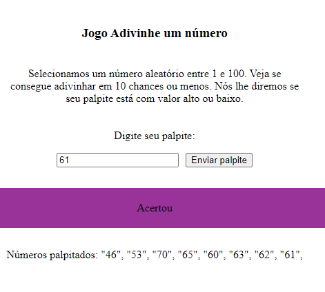

# jogoAdivinhaNumeroAleatorio


## Sobre o projeto

Este projeto é um jogo em que se adivinha algum número aleatório, até acertar o número. Estou usando HTML, CSS & JavaScript com DOM, manipulação de array, função Math do JS e tratamento de mensagem de erro quando a quantidade de números palpitados exceda o limite de 10 palpites.
<br>

### Layout Web



<br>

## Tecnologias utilizadas

### Front-End
* HTML / CSS / JS

<br>

## Como executar o projeto
```bash
# clonar repositório
git clone git@github.com:maxsueldev/jogoAdivinhaNumeroAleatorio.git

# entrar na pasta do projeto e abrir o arquivo index.html
```

<br>

## Autor
Maxsuel Santos

<https://www.linkedin.com/in/maxsuelfernandob/>
